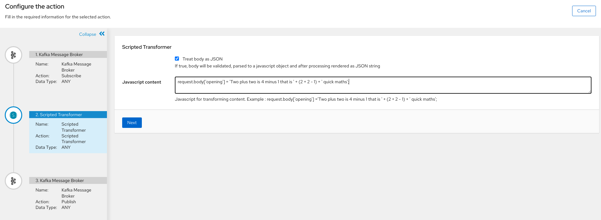

# Scripted transformations




This extensions provides a steps to perform transformations on the message headers and body using the javascript engine included in the JDK.

Javascript is conventient to use because it's easily testable outside of the tool.

Currently in order to access data fields, the input data needs to be in JSON String.

Click the 'Treat body as JSON' so that the component parses the body and renders it after the script is executed.

Predefined variables are :

* request.body : the message body
* request.body['key'] : access a field of the body
* request.headers['key'] : access to a header value
* exchange : access to the whole exchange object
* camelContext : access to the camel context

It also provides utility steps to transform payloads in a generic way
* parsejson : Parses JSON String to Java Object
* renderjson : Renders a Java Object to JSON String
* tostring : forces camel to transform streams and others to String

## How to install

Build the project

```
mvn clean package
```

Upload to extensions in Fuse Online

* Go to Customizations -> Extensions
* Click on Import Extension
* Upload Jar file

Use it in your Integrations :)
